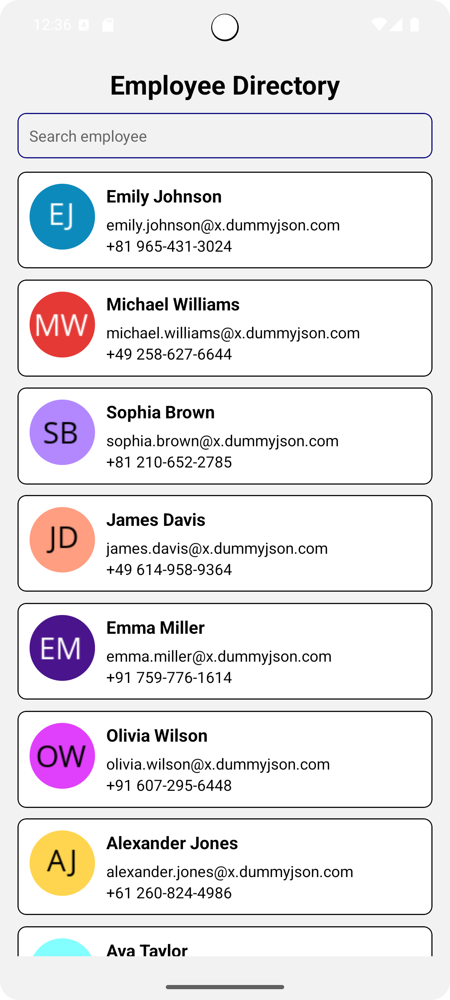

# Employee Directory App

A **React Native** mobile application demonstrating an employee directory with API integration, search functionality, infinite scrolling, Redux state management, and local data persistence.

## **Features**

1. **Screens and Navigation**
   - **HomeScreen**: Displays a list of employees loaded from a public API.
   - **DetailsScreen**: Shows detailed information for a selected employee.
   - Proper navigation implemented using React Navigation.

2. **Large List of Data**
   - Fetches a large dataset of users from a public API.
   - Uses **FlatList** for efficient rendering.

3. **Search Functionality**
   - Search employees by name dynamically.
   - Filter updates in real-time as the user types.

4. **Pagination / Infinite Scrolling**
   - Loads more data when the user scrolls near the end of the list.
   - Prevents unnecessary API calls for better performance.

5. **Redux for State Management**
   - Stores employee list, current page, search text, and loading state.
   - Ensures a single source of truth for the application state.

6. **Local Data Storage**
   - Uses `redux-persist` (with AsyncStorage) to persist employee data.
   - Restores list automatically after app restart or background/foreground transitions.

7. **App Lifecycle Handling**
   - Preserves app state when moved to background.
   - Restores data after app is killed and reopened.

8. **Dynamic Employee Avatars**
   - Avatars generated dynamically using [ui-avatars.com](https://ui-avatars.com).
   - Ensures every employee has a visible avatar based on their name.

## **Screenshots**

- **Home Screen**  

- **Details Screen**  

- **Search Functionality**  

